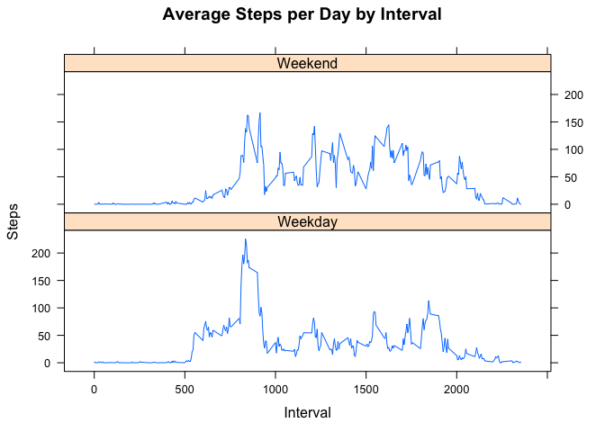

# Introduction

This project uses the activity data from monitoring devices such as Fitbit, Nike, Fuelband and Jawbone Up to discover activity patterns.


# Loading and preprocessing the data

Contains code for reading in the dataset and/or processing the data.

We start by doing preliminary work such as loading the libraries. Then we read the data and store it in the variable data. Then we convert the date variable to date data type and remove all the NAs from the dataset.


```r
suppressPackageStartupMessages(library(ggplot2))
suppressPackageStartupMessages(library(plyr))
suppressPackageStartupMessages(library(dplyr))

dat <- read.csv("/Users/apple/Desktop/Coursera/John Hopkins Stats Course/Reproducible Research/activity.csv")
dat$date <- as.Date(dat$date)

# Removing the NAs
dat <- na.omit(dat)
```

# What is mean total number of steps taken per day?

Contains a histogram for number of steps taken per day.


```r
tot <- aggregate(dat$steps,list(dat$date),sum)
qplot(tot$x,xlab="Total Number of Steps",ylab = "Frequency",binwidth=500)
```

<!-- -->

Mean and median number of steps taken each day
Note: Includes both interpretation of the question - Mean and Median per day as well as Mean and Median of all steps.


Mean of number of steps per day


```r
as.integer(mean(tot$x))
```

```
## [1] 10766
```


Median of (number of steps per day)


```r
as.integer(median(tot$x))
```

```
## [1] 10765
```

# What is the average daily activity pattern?


 Contains the Time series plot of the average number of steps taken


```r
five_min_steps <- aggregate(steps ~ interval, data = dat, FUN =mean)
plot1 <- ggplot(data = five_min_steps, aes(x = interval, y = steps)) + 
    geom_line() +
    xlab("Time Intervals") + 
    ylab("Total Number of Steps")
print(plot1)
```

<!-- -->

The 5-minute interval that, on average, contains the maximum number of steps


```r
max_step <- order(dat$steps,decreasing = TRUE)[1]
(dat$date)[max_step]
```

```
## [1] "2012-11-27"
```

# Imputing missing values

Contains Code to describe and show a strategy for imputing missing data. The NAs are replaced with averages.


```r
data <- read.csv("/Users/apple/Desktop/Coursera/John Hopkins Stats Course/Reproducible Research/activity.csv")
steps_by_interval <- aggregate(steps ~ interval, data, mean)
imputed_data <- transform(data, steps = ifelse(is.na(data$steps), steps_by_interval$steps[match(data$interval, steps_by_interval$interval)], data$steps))
#Replacing NAs with zeros
imputed_data[as.character(imputed_data$date) == "2012-10-01", 1] <- 0
```

Creating a histogram


```r
steps_by_day <- aggregate(steps ~ date, imputed_data, sum)
hist(steps_by_day$steps, main = paste("Total Steps Each Day"), col="blue", xlab="Number of Steps")
```

<!-- -->

Printing the mean and the median


```r
mean(steps_by_day$steps)
```

```
## [1] 10589.69
```

```r
median(steps_by_day$steps)
```

```
## [1] 10766.19
```


# The activity pattern


```r
weekdays <- c("Monday", "Tuesday", "Wednesday", "Thursday", 
              "Friday")
imputed_data$dow = as.factor(ifelse(is.element(weekdays(as.Date(imputed_data$date)),weekdays), "Weekday", "Weekend"))

steps_by_interval_i <- aggregate(steps ~ interval + dow, imputed_data, mean)

library(lattice)

xyplot(steps_by_interval_i$steps ~ steps_by_interval_i$interval|steps_by_interval_i$dow, main="Average Steps per Day by Interval",xlab="Interval", ylab="Steps",layout=c(1,2), type="l")
```

<!-- -->

It looks like people move around a lot more on Weekends.
